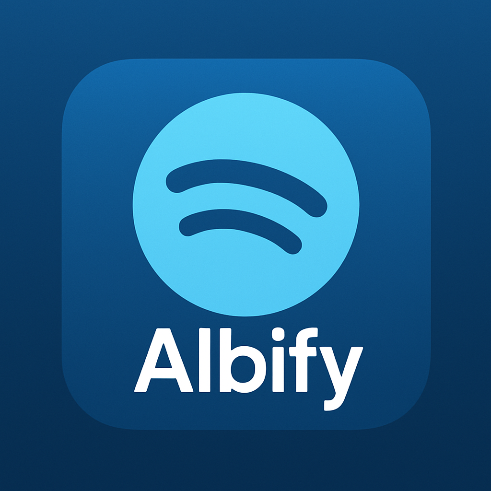

# Albify - Piattaforma Streaming Musicale

Una moderna piattaforma di streaming musicale che offre un'esperienza di scoperta musicale intelligente e collaborativa, con interfaccia completamente in italiano.

## Caratteristiche Principali

- Frontend React.js con TypeScript e interfaccia in italiano
- Integrazione con YouTube Music API con sistema di rotazione delle chiavi
- Playlist condivise "Top Hits" con brani popolari per tutti gli utenti
- Player musicale dinamico con funzionalità avanzate
- Ricerca avanzata con caching e gestione delle playlist
- Autenticazione sicura multi-utente con accesso controllato
- Design responsive che si adatta a dispositivi desktop e mobile
- Sistema di caching integrato per ottimizzare le chiamate API

## Tecnologie Utilizzate

- **Frontend**: React.js, TypeScript, TailwindCSS, shadcn/ui
- **Backend**: Node.js, Express
- **Database**: PostgreSQL (compatibile con Supabase)
- **API Esterne**: YouTube Data API v3
- **Deployment**: Vercel

## Deploy su Vercel

### Prerequisiti

1. Account GitHub
2. Account Vercel
3. Chiavi API YouTube (da 1 a 4 chiavi)
4. Database Supabase o PostgreSQL

### Configurazione Rapida

Per i dettagli completi sul processo di deployment, consulta il file [`VERCEL_ISTRUZIONI.md`](./VERCEL_ISTRUZIONI.md).

1. Importa questo repository su GitHub
2. Connetti il repository a Vercel
3. Configura le variabili d'ambiente:
   - `YOUTUBE_API_KEY_1` (obbligatoria)
   - `YOUTUBE_API_KEY_2`, `YOUTUBE_API_KEY_3`, `YOUTUBE_API_KEY_4` (opzionali)
   - `DATABASE_URL` (stringa di connessione al database)
4. Deploy!

## Funzionalità Principali

- **Playlist Top Hits**: Una playlist predefinita con brani popolari, condivisa con tutti gli utenti
- **Importazione da YouTube**: Importa video singoli o intere playlist da YouTube
- **Preferiti**: Salva i tuoi brani preferiti per un accesso rapido
- **Player Musicale**: Interfaccia intuitiva per la riproduzione di brani
- **Ricerca Avanzata**: Cerca brani su YouTube direttamente dall'app
- **Interfaccia Responsive**: Design ottimizzato sia per desktop che per mobile

## Struttura del Progetto

- `client/`: Codice frontend React
- `server/`: API e logica backend
- `shared/`: Tipizzazioni e schemi condivisi
- `vercel.json`: Configurazione per il deploy su Vercel
- Script di utilità:
  - `verify-youtube-api.js`: Verifica le API di YouTube
  - `verify-database.js`: Verifica la connessione al database

## Sviluppo Locale

1. Clona il repository
2. Crea un file `.env` basato su `.env.example` e inserisci le tue chiavi API
3. Installa le dipendenze: `npm install`
4. Avvia il server di sviluppo: `npm run dev`
5. Verifica le configurazioni:
   - `node verify-youtube-api.js` (verifica API YouTube)
   - `node verify-database.js` (verifica connessione database)

## Account di Test

Durante lo sviluppo, questi account sono disponibili per il testing:

- albertorossi2005@gmail.com / password123 (username: Ciccio92)
- ziopanax@boss.com / PanaxBoss (username: Panax)
- olga@gmail.com / Olga1234 (username: Olgx)

## Licenza

Copyright (c) 2025 - Tutti i diritti riservati